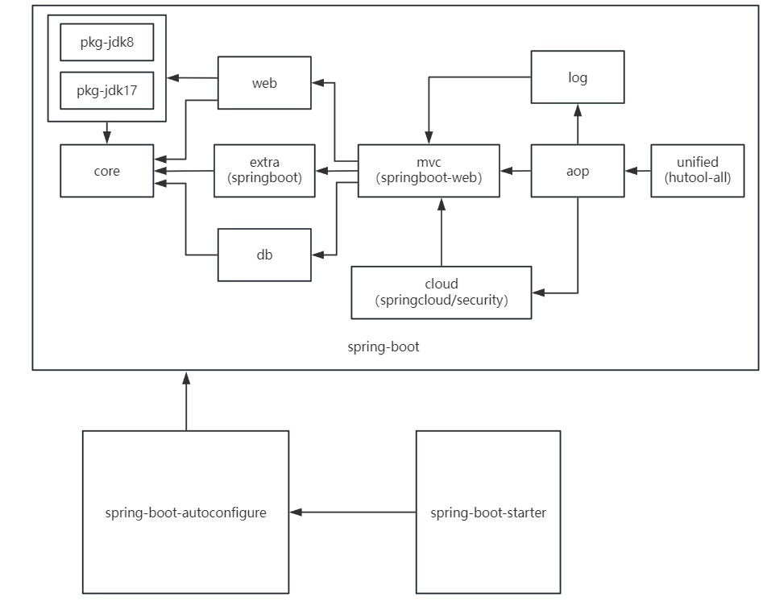

# xingtools 工具包

## :book:相关介绍
xingtools sdk 工具包，v1.1.7 正式版发布。( 依赖的版本不能低于 1.1.1 )
星天（xingtian）制作的 Java 工具包，是基于 Springboot 2.7.18 和 SpringBoot 3.0.5 制作的 ,  基于 Java 8 和 Java 17，它是一个整合各工具类的整合包。

### :scroll:简介

是一个功能丰富且易用的 **Java工具库**，通过诸多实用工具类的使用，旨在帮助开发者快速、便捷地完成各类开发任务。 这些封装的工具涵盖了hutool包（依赖[hutool包](https://gitee.com/dromara/hutool)）, 部分 ruoyi 工具类，包含了系列字符串、数字、集合、编码、日期、文件、IO、加密、数据库JDBC、JSON、HTTP客户端等一系列基础操作，还包含了 ACM算法，JDK版本兼容包，各种base接口，快速开发工具类（链式调用、逻辑建造）、注解AOP装配，配置自动装配，Spring 扩展，Security扩展，OAuth2扩展，Cloud扩展，可以满足各种不同的开发需求。

目前仍使用 xingtool 文档 v1.0.5 [使用文档](使用文档.md)，未来会更新，别急哦各位，大部分类名及用法没有更改，可以参考。

###   :golf:本包说明

该依赖为 xingtools sdk 工具包 分组版本。 它是一个整合各工具类的整合starter。具体详情详见 [xingtool-spring-boot-starter](https://gitee.com/SangonomiyaKokomi/xingtool)  这个原sdk。 该分组工具包为升级版，将核心拆分应对不同使用情况，大大提高灵活性，未来原sdk可能会依赖该升级版的sdk。如果你是jdk任何版本（ jdk8, jdk17 ）都可以进行使用。唯一缺点就是可能会需要多个（两个及以上，因为需要导入pkg的jdk版本包）的依赖。

## :wrench:包含组件

| 模块                                | 介绍                                                         |
| ----------------------------------- | ------------------------------------------------------------ |
| xingtools-core                      | 核心，包括各种接口，实体类和工具类                           |
| xingtools-pkg-jdk8                  | 依赖core包，jdk 分类包，对不同的jdk版本提供兼容性            |
| xingtools-pkg-jdk17                 | 依赖core包，jdk 分类包，对不同的jdk版本提供兼容性            |
| xingtools-web                       | 依赖core和pkg包，提供一些 http 工具                          |
| xingtools-extra                     | 依赖core，附加，也就是基于 SpringBoot 的一些工具或实体类     |
| xingtools-db                        | 依赖core，数据库操作，包含mybatis-plus等操作                 |
| xingtools-mvc                       | 依赖web，extra，db三包，基于 SpringBoot-Web的一些集成工具或实体类 |
| xingtools-log                       | 依赖mvc，包含日志扩展操作的封装                              |
| xingtools-cloud                     | 依赖mvc，基于SpringCloud，包括各种 cloud，security，oauth 的工具 |
| xingtools-aop                       | 依赖mvc，log，cloud三包，提供前面依赖的aop注解和切面类       |
| xingtools-unified                   | 依赖aop，整合包，整合所有依赖并依赖 hutool-all               |
| xingtools-spring-boot               | 整合版本，排除pkg-jdk依赖，在这之后需要配合pkg-jdk依赖使用   |
| xingtools-spring-boot-autoconfigure | 整合版本的自动装配，含各种自动装配配置，开关，注解，类等     |
| xingtools-spring-boot-starter       | 最终依赖包                                                   |

当前版本组件之间的依赖关系如下：（v1.1.2 开始组件依赖更新，后续沿用该依赖关系）



​																**组件依赖关系图**

目前使 pkg包 仅依赖 core 包，可以按需导入从前面开始的依赖。

## :bookmark:依赖使用

### :inbox_tray:安装教程

> 使用 Maven 导入依赖

Maven 依赖（JDK8版本）

```xml
<dependency>
	<groupId>top.cutexingluo.tools</groupId>
	<artifactId>xingtools-spring-boot-starter</artifactId>
	<version>1.1.7</version>
</dependency>
<dependency>
	<groupId>top.cutexingluo.tools</groupId>
	<artifactId>xingtools-pkg-jdk8</artifactId>
	<version>1.1.7</version>
</dependency>
```

Maven 依赖（JDK17版本）

```xml
<dependency>
	<groupId>top.cutexingluo.tools</groupId>
	<artifactId>xingtools-spring-boot-starter</artifactId>
	<version>1.1.7</version>
</dependency>
<dependency>
	<groupId>top.cutexingluo.tools</groupId>
	<artifactId>xingtools-pkg-jdk17</artifactId>
	<version>1.1.7</version>
</dependency>
```

第二个包 （pkg包） 代表存在兼容 jdk 版本的工具，必须存在。

目前推荐使用的版本如下：（其他版本有一定bug，如需使用请参考更新公告的版本使用攻略）

```wiki
极力推荐使用最新版 v1.1.7
xingtools v1.1.3, v1.1.4, v1.1.5, v1.1.6, v1.1.7
xingtool v1.0.1, v1.0.4, v1.0.5
```

如果想使用老版本依赖，可以使用以下依赖 (xingtool 仅支持 JDK8 )

```xml
<dependency>
	<groupId>top.cutexingluo.tools</groupId>
	<artifactId>xingtool-spring-boot-starter</artifactId>
	<version>1.0.5</version>
</dependency>
```

### :apple:使用方式

#### :lemon:使用讲解

1). 可以通过Util.静态类的方式调出静态方法，一般由XT开头的类，例如XTObjUtil等，以便直接调出类名、方法，根据类名意思了解该功能，好处是暂时不用查文档，并且和hutool互补，能够加快开发效率。
2). 可以通过new的方式获得非单例对象，也是常用的方式。
3). 在启动类上加上@EnableXingToolsServer，开启自动注入，比如默认开启的两个注解aop(例如@Printlog注解，以及其他现版本默认未开启的各种日志异常拦截aop等),其他的配置或者aop需要在配置文件中开启，以xingtools开头即可点出，例如

```properties
# 开启 redis
xingtools.enabled.redisconfig=true
# 开启 redis 的多个工具类，需 @Autowired 注入使用
xingtools.enabled.redisconfig-util=true
# 使用jackson2序列化(默认，可以不用配置)
xingtools.enabled.redisconfig-setting=jackson
# 默认全局异常拦截
xingtools.enabled.global-exception=true
# mybatis-plus 分页插件 这个还是推荐自己注册Bean
xingtools.enabled.mybatis-plus-config=true
```
> 注意这些只是进行了简单的配置，也就是大多数人的需求，也暂时不用每次自行创建配置类等。

> 所有aop和配置都可以通过配置类或者自行bean导入，导入启动后，会有日志说明配置启动成功，也可以用xingtools.enabled.log-info=false把自动导入的日志关闭。**由于减少侵入和大小占用，有些相应的配置解释会提供工件名，请自行配置相关依赖。**

- 4).也就是SpringSecurity,SpringCould的相关配置,可以通过配置@EnableXTCloudSecurity，@EnableXingToolsCloudServer，开启相关Security和Could的简化配置，精简你的项目。

综上不管是简单作为工具包，或者简化你的SpringBoot,SpringCloud等项目，该Starter放到你的依赖里也是一种不错的选择。

#### :pear:使用说明

1.  静态工具类，new对象
2.  @EnableXingToolsServer等注解启动装配，使用配置文件快捷开启对应配置


如有bug，欢迎反馈。

## :game_die:使用样例（xingtools v1.1.7 版本）

本只做样例阐述，下面示例只是皮毛，更多更丰富的工具还在内部。

由于下一节的 xingtool 有些使用样例过时或不推荐，现在更新使用样例，其他请优先阅读源码再参考文档。

### 1. 数据封装类，Controller 层

```java
// controller 示例
@RestController
@RequestMapping("/common")
public class CaptchaController {
    /**
     * 获取验证码（放行）
     */
    @Operation(operationId = "getCaptchaInfo") //open-api
    @GetMapping("/captcha") // 接口
    public MyResult<?> getCaptchaInfo() {

        HashMap<String, String> captcha = captchaService.getCaptcha();
        
        // 新版返回方式，可使用自定义返回类，更优雅
        return ResultUtil.selectFill(captcha,
                EnumResult.GET_SUCCESS,
                EnumResult.GET_ERROR,
                new MyResult<>());
        
        // 新版返回方式2
        return ResultUtil.selectFill(captcha,
                MyResult.fillBy(EnumResult.GET_SUCCESS),
                EnumResult.GET_ERROR); // 返回自定义的MyResult对象
        
        // 也可以使用下面传统返回方式 (使用xingtools自带的 Result 及成功和失败策略)
        return ResultUtil.selectResult(captcha); // 返回Result对象
        
		// ResultUtil 工具类 默认策略(可以更改) 等同于下面 
        return captcha == null || Boolean.FALSE.equals(captcha)  ? 
            	MyResult.errorBy(EnumResult.GET_ERROR):
                MyResult.successBy(EnumResult.GET_SUCCESS).setData(captcha);
    }
}
```

有人会说：我不想使用你的 Result 这个封装返回类，能不能自己定义。这是可以的，在1.0.3版本，统一了4个返回类，全部继承于CommonResult类，该类的基本属性如下：

```java
public class CommonResult<C, T> implements IResultSource<C, T> {
    protected C code;
    protected String msg;
    protected T data;
}
```

它实现 IResultSource 接口，而我们可以直接实现 IResultSource 接口或者再往上仅实现 IResult 接口就行了。基本上工具包的很多方法参数都是 IResult 接口或者 IResultSource接口(比IResult多了set方法)。我们可以直接实现该接口像这样：

```java
@Data
@NoArgsConstructor
@AllArgsConstructor
@Accessors(chain = true)
public class MyResult implements IResultSource<Integer, Object> {
    protected Integer retCode; // 不想使用 code，想使用 retCode
    protected String message; // 不想使用 msg，想使用 message
    protected Object data;
    
    @Override
    public Object getData() { // 使用原 getData 方法
        return data;
    }
    @JsonIgnore // 屏蔽原方法，避免序列化
    @Override
    public Integer getCode() { 
        return retCode;
    }
    @JsonIgnore // 屏蔽原方法，避免序列化
    @Override
    public String getMsg() {
        return message;
    }
}
```

对于不需要json转化的字段进行@JsonIgnore忽略掉就行。

同理如果不需要data字段，再往上实现 IResultData 接口 (包含code和msg) 就可以，工具包里面的很多异常或者枚举都是实现了该接口, 因为基本上都需要 code 和 msg 两种属性。

如果仅需要 msg 属性，仅需实现 IR 接口 ，需要 msg 和 code 需要实现 IResultData 接口，以此类推。

### 2.工具类使用，例如锁，异步(多线程)

锁提供基本的 LockHandler 类，以及下面的子类 XTLockHandler , XTExtLockHandler 等类。

下面是 LockHandler 的基本使用。

```java
    @Test
    void test11() {
        XTLockMeta lockMeta = new XTLockMeta(XTLockType.ReentrantLock);
        LockHandler lockHandler = new LockHandler(lockMeta);
        lockHandler.init();
        // Spring 的线程池
        ThreadPoolTaskExecutor executor = new ThreadPoolTaskExecutor();
        executor.setCorePoolSize(5);
        executor.setMaxPoolSize(10);
        executor.initialize();


        // Runnable 接口
        XTAsync.runAsync(() -> { // 继承 CompleteFuture 类，扩展了一些静态方法
            lockHandler.lock(() -> {// Callable 接口
                for (int i = 0; i < 20; i++) {
                    XTJUC.sleepMillis(100); // 目前仅两个线程方法，睡100ms
                    System.out.println(Thread.currentThread().getName() + "," + i);
                }
                return null; // 返回值
            }, null);
        }, executor);


        XTAsync.runAsync(() -> {
            lockHandler.lock(() -> {
                for (int i = 0; i < 20; i++) {
                    XTJUC.sleepMillis(80);
                    System.out.println(Thread.currentThread().getName() + "," + i);
                }
                return null;
            }, null);

        }, executor);

        XTJUC.sleepMillis(100_000);
    }
```


### 3.实体工具类使用，例如日志打印

打印日志一般只需要 以下代码或者 lombok 的 @Slf4j 注解

```java
private static final Logger log = LoggerFactory.getLogger(XXX.class);
```

而提供的 ILogProvider 接口支持多个实现，例如log4j,log4j2,slf4j等，可以直接使用，但需要导入相应的依赖。

提供的 ILogHandler 接口含义 send 方法，提供打印的动作，是为了方便适配自定义打印动作，提高灵活性。

下面是直接使用方式

```java
    @Test
    void test3() {
        // LogHandler  使用 slf4j, info 模式打印
        LogHandler logHandler = new LogHandler(new LogSlf4j(), LogLevel.INFO);
        logHandler.send("hello world");
        // LogPkg.slf4j  打印
        ILogHandler logHandler1 = LogPkg.SLF4J_PKG.getLogHandler();
        logHandler1.send(LogLevel.ERROR, "hello world23");
    }
```

一般情况下会使用打印策略配合使用，支持SpEL 表达式等更加高级的使用方式。

示例如下, 打印的字符串会通过配置对 ${} 包裹的字符串进行替换。

```java
@Slf4j // 提供log
@Configuration
public class WebLogHandlerConfig {
	/**
     * 访问日志打印
     */
    public static final String ACCESS_LOG_KEY = "当前用户 userId : ${userId}" + LogKey.COMMAS
            + LogKey.IP_STR + LogKey.COMMAS
            + LogKey.HOST_IP + LogKey.COMMAS
            + LogKey.URI + LogKey.COMMAS
            + LogKey.HTTP_METHOD;
	@Bean
    public WebLogConfig webLogConfig() { // config 配置
        DefaultWebLogStrategy strategy = new DefaultWebLogStrategy(); // 默认策略(组装字符串)
        WebLogConfig config = new WebLogConfig(strategy); // 设置策略
        config.setLogProvider(new LogSlf4j(log)); //使用 slf4j, log
        config.setLevelCode(LogLevel.INFO); // info 级别
        config.setMsg(ACCESS_LOG_KEY); // 配置打印的字符串
        return config;
    }

    public WebLogHandler newWebLogHandler(WebLogConfig webLogConfig) { // handler 处理器
        WebLogHandler handler = new WebLogHandler(webLogConfig).initDefaultMap().modifyAll(); // 初始化变量值，可以在这里设置全局 map 映射
        return handler;
    }
}
```

然后使用 WebLogHandler 对象 (该类继承 LogHandler，提供web方面的支持)

```java
    /**
     * 访问日志打印
     * <p>当前用户 userId : x </p>
     */
    protected void accessLog(HttpServletRequest request, LoginUser loginUser, String ip) {
        // 三位一体切面捆绑类，一般用于 aop 等切面类
        AspectBundle aspectBundle = new AspectBundle( // web 捆绑类
                null, // Method 类，目前不需要
                HttpServletRequestData.of(request), // HttpServletRequest适配类,需要为其他默认 ACCESS_LOG_KEY 映射提供来源，如 LogKey.URI 等
                null // ProceedingJoinPoint 类，切面对象，目前不需要
        );
        // 添加打印变量
        HashMap<String, String> map = newWebLogHandler(webLogConfig).getMsgMap().getKeyMap();
        // 这里开始可以加锁
        // 存 userId
        map.put("userId", String.valueOf(loginUser.getUser().getId()));
        // 存 ip
        map.put("ip", ip);

        webLogHandler.send(aspectBundle); // 打印
    }
```

如果有并发问题，请自行将设置值和打印值的部分加锁。

### 4.系列注解使用，例如参数校验和异步线程

#### ***参数校验** （必须导入 validation 包 并且参数添上@Valid或@Validated ）

```java
@Data
@AllArgsConstructor
@NoArgsConstructor
public class MyUserQuery {

    // 1.首先如果非空字符串和 null 均会进入下一步
    // 2.必须匹配下面指定字符串
    @StrStatus(anyStr = { // 必须匹配的字符串
            "1", "0"
    }, message = "类型格式错误",notBlankIfPresent = true) 
    private String type;

    @StrStatus(anyReg = { // 正则匹配
            RegexPool.MOBILE
    }, message = "手机格式错误") // 验证
    @StrJson(value = SensitiveSerializer.class, name = "PHONE") //脱敏
    private String phone;

    @NotBlank(message = "邮箱不能为空")
    @Email(message = "邮箱格式错误") //validation包的校验
    private String email;

    @StrJson(value = SensitiveSerializer.class, name = "") // 返回值脱敏
    private String password;
    
    /**
     * 逻辑删除（1删除）
     */
    @ShortStatus(
            matchNum = {
                    EnumDelFlag.NOT_DELETED_CODE,
                    EnumDelFlag.IS_DELETED_CODE
            },
            message = "删除状态格式错误"
    )
    private Short delFlag;
}

```

#### 异步线程 

1.可以使用**编程式**，例如 XTAsync, 或者你的类实现 ThreadHelper 接口或者  ThreadExecutorHelper 接口

下面示例作为 异步配置，同时兼容ThreadPoolTaskExecutor, AsyncConfigurer(支持@Async 注解)和 ThreadHelper (CompletableFuture 编程式操作)

```java
@EnableAsync
@Configuration
public class AsyncConfig implements AsyncConfigurer, ThreadHelper {

    @Autowired
    ThreadPoolTaskExecutor taskExecutor;

    @Override
    public Executor getAsyncExecutor() {
        return taskExecutor;
    }

    @Override
    public AsyncUncaughtExceptionHandler getAsyncUncaughtExceptionHandler() {
        return null;
    }

    @Override
    public Executor executor() {
        return taskExecutor;
    }
}
```

注入该对象即可使用ThreadHelper里面的方法

2.使用**声明式**，但不一定会得到预期结果

一般情况下，只使用 XTAsync 静态方法类  (继承CompleteFuture类) 或者 XTCompletionService 对象 (继承ExecutorCompletionService) 即可

下面是声明式异步编程，添加注解方式。

TestThread 主线程类

```java
@Component
public class TestThread {
    @Autowired
    private ThreadResults threadResults; // 线程结果对象
    @Autowired
    private TestService testService;

    // value 建议和调用的子线程方法数量一致 , 默认策略 GetResultAfterLastSon 
    @MainThread(value = 2, startTime = ThreadTimePolicy.GetResultAfterLastSon)
    public void mainThread2() {
        testService.sonThread1(); // 子线程1 ,需要被代理，注解才能生效
        testService.sonThread2(); // 子线程2

        List<Object> results = threadResults.getResults();
        if (results != null) {//1. GetResultAfterLastSon 策略会在最后一个子线程阻塞等待 (所以上面的子线程数量必须一致) value数量的子线程执行完 , 所以该策略 results 始终会存在
            XTArrayUtil.printlnList(results); // 数组
        }

        List<Future<Object>> futures = threadResults.getFutures(); //2. GetFuture 策略，会在调用 getFutures 的 get处 阻塞，否则会在当前主方法执行完阻塞。所以这时候results会为空，所以需要调用 future 的 get方法 阻塞 等待完成。如果没有调用，则会在当前方法结束时阻塞。
        XTArrayUtil.printlnList(futures);

        futures.forEach(future -> {
            try {
                System.out.println(future.get());
            } catch (InterruptedException | ExecutionException e) {
                e.printStackTrace();
            }
        });
    }
}
```

TestService 子线程类

```java
@Service
public class TestService {
    @SonThread(threadPoolName = "threadPoolExecutor") // 指定 Spring容器 里面线程池名称
    public String sonThread1() {
        System.out.println("进入sonThread1");
        XTTime.sleepBySecond(3); 
        System.out.println("sonThread1 已经睡了3秒");
        return "hello --> sonThread1";
    }
    @SonThread(threadPoolName = "threadPoolExecutor")
    public void sonThread2() { // 无返回值
        System.out.println("进入sonThread2");
        XTTime.sleepBySecond(1);
        System.out.println("sonThread2 已经睡了1秒");
    }

}
```

### 5.快速建造工具

#### 1.HashMap扩展

为 HashMap 添加值

```java
void test() {
    HashMap<String, Integer> hashMap = new HashMap<>();

    // 为 map 添加 key,value 对
    int i = XTHashMap.putMapEntriesFromDValues(
        hashMap,
        "hello", 1,
        "world", 2
    );


    System.out.println(hashMap); // {world=2, hello=1}

	// 为 map 的 list value 补充值, check 代表不存在就 new 一个ArrayList填充进去
    HashMap<String, List<String>> hashMap1 = new HashMap<>();
    XTMapUtil.checkAddAll(hashMap1, "hello", ArrayList::new,
                          Arrays.asList("hello", "world"));
    XTMapUtil.checkAddAll(hashMap1, "hello", ArrayList::new,
                          Arrays.asList("hello1", "world1"));


    System.out.println(hashMap1); // {hello=[hello, world, hello1, world1]}
}
```

#### 2.Optional 功能扩展类 StreamChain

StreamChain 包含 Optional 几乎所有方法，还对其进行了扩展

```java
void test() {
    StreamChain<Integer> chain = StreamChain.ofNullable(null)
        .directMap(v -> v == null ? 2 : (int) v + 1);
    System.out.println(chain); // StreamChain[2]

    StreamChain<Integer> streamChain = new ObjectStreamChain(1)
        .cast(Integer.class)
        .flatMap(StreamChain::ofNullable)
        .map(v -> v + 1);
    System.out.println(streamChain); // StreamChain[2]

    ObjectStreamChain objectStreamChain = new ObjectStreamChain(2);
    System.out.println(objectStreamChain);// StreamChain[2]

    System.out.println(objectStreamChain.equals(streamChain)); // true

    StreamChain<Integer> opt = StreamChain.ofNullable(1);
    List<Integer> collect = opt.stream().collect(Collectors.toList());
    Integer integer = opt
        .flatMap(StreamChain::of)
        .get();
    System.out.println(integer); // 1
    System.out.println(opt); // StreamChain[1]
    System.out.println(collect); // [1]

}
```

#### 3.高级建造类 BuilderMapChain

生成一个建造树，如果当前层的值不存在，便可以从其他兄弟节点获取或生成，或者从父节点生成，直到得到值，返回。

```java
void test15() {
    BuilderMapChain chain = new BuilderMapChain(3, null,  () -> {
        // 第1层
        return "第1层,";
    }).withGetter(null, o -> {
        // 第2层
        String str = (String) o;
        str += "第2层,";
        return str;
    }).withListGetter(null, Arrays.asList( // 第3层
        (o) -> { // 从上1层获取数据
            String str = (String) o;
            str += "第3层-1,";
            return str;
        },
        (o) -> { // 从上2层获取数据
            String str = (String) o;
            str += "第3层-2,";
            return str;
        }
    ));
    
    // 下面三块是独立的，不在同一个方法内，因为创建便会填充数据（一次性对象）。
    
    Entry<Integer, String> entry = chain.createFrontDfs(3); // 前驱dfs创建3层
    System.out.println(entry); // Entry [key=3, value=第1层,第2层,第3层-1,]
    String s = chain.getValue(3); // 获取第3层数据
    System.out.println(s); // 第1层,第2层,第3层-1,

    Entry<Integer, String> entry2 = chain.createBackBfs(2); // 后驱bfs创建2层
    System.out.println(entry2); // Entry [key=1, value=第1层,第2层,]
    String s2 = chain.getValue(2); // 获取第2层数据
    System.out.println(s2); // 第1层,第2层,
    
    Entry<Integer, String> entry3 = chain.createBackDfs(3); // 后驱dfs创建3层
    System.out.println(entry3); // Entry [key=2, value=第1层,第3层-2,]
    String s3 = chain.getValue(3); //获取第3层数据
    System.out.println(s3); // 第1层,第3层-2,
}
```

第3层数据不为null，则返回数据。

第3层数据为null，便从第3层 front（List 从前往后，前驱），back（List 从后往前，后驱）获取生成方法（用于生成该层数据，填充到该层），dfs （依次获取上层数据，直至能填充目标层数据）, bfs （先把该层List遍历完成，还没有填充数据才从上层获取）

**那么有什么用呢？**

示例如下：

```java
void test{
    ...
    ApplicationContext applicationContext = SpringUtils.getApplicationContext(); // Spring 上下文
    // 创建3层建造树
    BuilderMapChain chain = new BuilderMapChain(3, applicationContext) 
        .with(redisTemplate, o -> { // redisTemplate 数据
            ApplicationContext ac = (ApplicationContext) o;
            return ac.getBean(RedisTemplate.class); // redisTemplate 数据不存在则从容器获取
        }).withList(redisCache, Arrays.asList(
        o -> {
            RedisTemplate<String, Object> rt = (RedisTemplate<String, Object>) o;
            return new RYRedisCache(rt); // 填充进 RYRedisCache
        },
        o -> {
            ApplicationContext ac = (ApplicationContext) o;
            return ac.getBean(RYRedisCache.class); // RYRedisCache 数据不存在则从容器获取
        }
    ));
    
    // 得到生成的值
    RYRedisCache redisCache = chain.createFrontDfs(3).getValue(3);
}
```

里面有许许多多快速开发的工具，还请多多研究。

### 6.*系列算法

算法都放在  top.cutexingluo.tools.utils.se.algo.cpp 包下，顾名思义，工具/SE/算法/C++，

例如二分查找

```java
int index = XTBinarySearch.lowerBound(new int[]{1, 2, 3, 4, 5, 6, 7, 8, 9, 10}, 5);
// c++ std::lower_bound 找到大于或等于目标的数据的位置, index = 4
```

例如字符串算法，在字符串里面查找子串，原生java是一个个匹配，遇到多重复字符速度变慢。

这里有KMP算法

```java
int index = XTStringAlgo.find("abcabcabc...abcdabcabcabc", "abcd");// 查找重复字符串
```

例如数据结构，简易线段树，线段树，动态线段树，平衡二叉树，树状数组，字典树，Splay树，Treap树，B 树，B+ 树的基础实现，可供参考

```java
BTree<String, String> tree = new BTree<>(3); // B树
BPlusTree<String, String> tree = new BPlusTree<>(3); // B+树
tree.put("1", "1");
tree.put("4", "4");
tree.put("2", "2");
// 实现 NavigableMap 接口，兼容基本操作
```

例如数学

```java
Point a = new Point(1.0,1.0);
Point b = new Point(1.0,2.0);
double dis = a.distance(b); // 两点距离
Point middle = a.middle(b); // 两点中点
```

例如图论，Dijkstra 最短路，最小生成树，网络流等

例如状态机（类似 map）

```java
NodeStateMachine<Integer, StatusNode<EnumPay, EnumPay>> stateMachine = new NodeStateMachine<>();
stateMachine.put(EnumPay.ALIPAY.getCode(),
        new StatusNode<>(EnumPay.ALIPAY,
                Arrays.asList(
                        EnumPay.ALIPAY,
                        EnumPay.WECHAT,
                        EnumPay.UNIONPAY
                )
        ));
stateMachine.put(EnumPay.WECHAT.getCode(),
        new StatusNode<>(EnumPay.WECHAT,
                Arrays.asList(
                        EnumPay.WECHAT,
                        EnumPay.UNIONPAY
                )
        ));
boolean accept = stateMachine.canAcceptNode(EnumPay.ALIPAY.getCode(), EnumPay.ALIPAY.getCode());
System.out.println(accept); // true

boolean accept1 = stateMachine.canAcceptNode(EnumPay.ALIPAY.getCode(), EnumPay.WECHAT.getCode());
System.out.println(accept1); // true

boolean accept2 = stateMachine.canAcceptNode(EnumPay.ALIPAY.getCode(), EnumPay.UNIONPAY.getCode());
System.out.println(accept2); // false

boolean accept3 = stateMachine.canAcceptNode(EnumPay.ALIPAY.getCode(), EnumPay.CASH.getCode());
System.out.println(accept3); // false

StatusNode<EnumPay, EnumPay> node = stateMachine.get(EnumPay.ALIPAY.getCode());
System.out.println(node); // StatusNode(node=ALIPAY, nextNodes=[ALIPAY, WECHAT, UNIONPAY])
boolean contains = node.getChildren().contains(EnumPay.ALIPAY);
System.out.println(contains); // true
```


未完待续...

具体内容详见源码和使用文档。

其他丰富的 工具，算法，注解， 自动配置 等均可在源码注释上看到使用说明，多查看源码。


## :game_die:使用样例（xingtool v1.0.5 版本）(老版本)

以下xingtool v1.0.5版本的使用样例，可以加快你的开发

##### 1. 数据封装类，Controller 层

```java
@RestController
@RequestMapping("/admin")
public class AdminController {
    
    @RequestLimit // 限流注解
    @WebLog(match = "ip:uri:method+s+tab+ip", levelStr = "info", referer = "log1") // 打印日志注解
    @GetMapping("/user/getAll")
    public Result getAll() { // Result 对象 推荐使用
        //ResultUtil.selectResult 动态解析返回值 (false和null得到获取失败) 也可以直接使用 Result.success()
        return ResultUtil.selectResult(adminService.getAll(),"获取成功","获取失败"); 
    }
    
    // 这个注解是打印日志，其中一个策略是可以使用spEL表达式执行任意方法
    @WebLog(spEL = " @testService.hello ( #msgMap, #bundle ,'hello world') ") 
    @GetMapping("/user/getOne")
    public R<UserInfo> getOne() { // R对象 alias MSResult 支持泛型
        //ResultUtil.selectResult 动态解析返回值 (false和null得到获取失败) 也可以直接使用 Result.success()
        return ResultUtil.selectR(adminService.getOne(),"获取成功","获取失败"); 
    }
}
```

有人会说：我不想使用你的 Result 这个封装返回类，能不能自己定义。这是可以的，在1.0.3版本，统一了4个返回类，全部继承于CommonResult类，该类的基本属性如下：

```java
public class CommonResult<C, T> implements IResultSource<C, T> {
    protected C code;
    protected String msg;
    protected T data;
}
```

它实现 IResultSource 接口，而我们可以直接实现IResultSource或者再往上仅实现 IResult 接口就行了。基本上工具包的很多方法参数都是IResult 接口。我们可以直接实现该接口像这样：

```java
@Data
@NoArgsConstructor
@AllArgsConstructor
public class MyResult implements IResult<String,Object> {
    protected String retCode; // 不想使用 code，想使用 retCode
    protected String message; // 不想使用 msg，想使用 message
    protected Object data;
    
    @Override
    public Object getData() {
        return data;
    }
    @JsonIgnore
    @Override
    public String getCode() {
        return retCode;
    }
    @JsonIgnore
    @Override
    public String getMsg() {
        return message;
    }
}
```

对于不需要json转化的字段进行@JsonIgnore忽略掉就行。

同理如果不需要data字段，再往上实现 IResultData 接口(包含code和msg) 就可以，工具包里面的很多异常或者枚举都是实现了该接口。


##### 2.工具类使用，拦截器 以 OAuth2 为例（springboot2.x版本）

```java
@Component
public class MyTokenFilter extends OncePerRequestFilter {


    @Autowired
    private TokenStore tokenStore;

    // jwt解析类
    @Autowired
    private MyUserAuthenticationConverter myUserAuthenticationConverter;

    RYRedisCache redisCache;

    // 构造注入
    @Autowired
    public MyTokenFilter(RYRedisCache redisCache, ApplicationContext applicationContext) {
        this.redisCache = redisCache;
        AccessLimitUtil.setRedisCache(redisCache);
        AccessLimitUtil.setApplicationContext(applicationContext);
    }


    @Override
    protected void doFilterInternal(HttpServletRequest request, HttpServletResponse response, FilterChain filterChain) throws ServletException, IOException {

        try {
            // AccessLimitUtil 工具类 ， 可以利用 Redis 进行限流
            // limitFilter 解析方法上的注解
            boolean check1 = AccessLimitUtil.limitFilter(request, response, filterChain);
            if (!check1) return;
            // limitFilter IP 拦截
            boolean check2 = AccessLimitUtil.limitIP(request, response, 1, 20,
                    "访问过于频繁，请稍后访问");
            if (!check2) return;
        } catch (Exception e) {
            XTResponseUtil.forbidden(response, e.getMessage()); // 返回 403
            return;
        }

        Authentication authentication;
        try {
            // XTAuthenticationUtil 执行链操作，对token进行解析
            authentication = new XTAuthenticationUtil 
                    .AuthenticationBuilder(request, XTAuthenticationUtil.USE_HEADERS | XTAuthenticationUtil.USE_COOKIES) // headers 和 cookies 都要解析
                    .setTokenExtractor(tokenExtractor)
                    .setTokenStore(tokenStore)
                    .setAccessTokenConsumer(accessToken -> {
                        //XTAccessTokenUtil 对Oauth2 包的 AccessToken类进行解析
                        if (XTAccessTokenUtil.isExpired(accessToken)) { 
                            throw new AuthenticationServiceException("Token String 已经过期！");
                        }
}).setAccessTokenAdditionalConverter(myUserAuthenticationConverter::extractAuthentication)
                    .repairCreate("").build(); // 对 Authorization 头 进行解析
        } catch (AuthenticationServiceException e) {
            XTResponseUtil.unauthorized(response, e.getMessage());// 401 返回
            return;
        }
        if (authentication != null) { // 解析到token，设置上下文
            SecurityContext context = SecurityContextHolder.getContext();
            context.setAuthentication(authentication);
        }
        // 如果没有解析到，authentication会为空，然后交给资源服务判定

        filterChain.doFilter(request, response); 
    }
}

```


##### 3.系列注解使用，例如参数校验和异步线程

###### **参数校验** （必须导入 validation 包 并且参数添上@Valid或@Validated ）

```java
@Data
@AllArgsConstructor
@NoArgsConstructor
public class MyUserQuery {

    // 1.首先如果非空字符串和 null 均会进入下一步
    // 2.必须匹配下面指定字符串
    @StrStatus(anyStr = { // 必须匹配的字符串
            "1", "0"
    }, message = "类型格式错误",notBlankIfPresent = true) 
    private String type;

    @StrStatus(anyReg = { // 正则匹配
            RegexPool.MOBILE
    }, message = "手机格式错误") // 验证
    @StrJson(value = SensitiveSerializer.class, name = "PHONE") //脱敏
    private String phone;

    @NotBlank(message = "邮箱不能为空")
    @Email(message = "邮箱格式错误") //validation包的校验
    private String email;

    @StrJson(value = SensitiveSerializer.class, name = "") // 返回值脱敏
    private String password;
}

```

###### 异步线程 

1.可以使用**编程式**，例如 XTAsync, 或者你的类实现 ThreadHelper接口

2.使用**声明式**，但不一定会得到预期结果

TestThread 主线程类

```java
@Component
public class TestThread {
    @Autowired
    private ThreadResults threadResults; // 线程结果对象
    @Autowired
    private TestService testService;

    // value 建议和调用的子线程方法数量一致 , 默认策略 GetResultAfterLastSon 
    @MainThread(value = 2, startTime = ThreadTimePolicy.GetResultAfterLastSon)
    public void mainThread2() {
        testService.sonThread1(); // 子线程1 ,需要被代理，注解才能生效
        testService.sonThread2(); // 子线程2

        List<Object> results = threadResults.getResults();
        if (results != null) {// GetResultAfterLastSon 策略会阻塞等待 value数量的子线程执行完 , 所以该策略 results 始终会存在
            XTArrayUtil.printlnList(results); // 数组
        }

        List<Future<Object>> futures = threadResults.getFutures(); // GetFuture 策略会阻塞在当前主方法执行完，所以这时候results会为空，所以需要调用 future 的 get方法 阻塞 等待完成。如果没有调用，则会在当前方法结束时阻塞。
        XTArrayUtil.printlnList(futures);

        futures.forEach(future -> {
            try {
                System.out.println(future.get());
            } catch (InterruptedException | ExecutionException e) {
                e.printStackTrace();
            }
        });
    }
}
```

TestService 子线程类

```java
@Service
public class TestService {
    @SonThread(threadPoolName = "threadPoolExecutor") // 指定 Spring容器 里面线程池名称
    public String sonThread1() {
        System.out.println("进入sonThread1");
        XTTime.sleepBySecond(3); 
        System.out.println("sonThread1 已经睡了3秒");
        return "hello --> sonThread1";
    }
    @SonThread(threadPoolName = "threadPoolExecutor")
    public void sonThread2() { // 无返回值
        System.out.println("进入sonThread2");
        XTTime.sleepBySecond(1);
        System.out.println("sonThread2 已经睡了1秒");
    }

}
```


未完待续...

具体内容详见使用文档。

##  :memo:更新公告

**2025-7-26  v1.1.7 (推荐)**

```txt
版本更新说明
当前版本逐渐趋于稳定，新增和改动内容少，逐渐可放心使用。

更改部分
1.移除 JavaVersion.EIGHT 防止报错
2.状态节点 StatusNode 面向接口 Collection
3.XTDateUtil 更新
4.JacksonSerializer bug 修正

新增部分
1.新增 EmptyChecker 等系列接口
2.新增 IPageDetail 接口，及其系列实现接口
3.新增链式调用接口 TaskChain, TaskNode 及实现类
4.新增 IValueSource 接口, 拥有setValue方法
```

**2024-11-22  v1.1.6**

```txt
版本更新说明
当前版本新增和修改了很多东西。比如对 Map.Entry 及各种 Node 节点类的支持，并新增 B树 和 B+ 树作为数据结构，增强了工具包的可用性。本次也对编码哈希加密等算法进行了重构，开始了面向接口使用，更加方便管理多种算法。相应的迭代器，比较器都进行了增强。二分查找也单独提取出来。重要的是现在能够同时支持 spring-cloud-starter-security, spring-cloud-starter-oauth2, spring-security-oauth2-authorization-server 三种框架的组合和兼容。

更改部分
1.*重构迭代器，比较器，使之更通用，更健壮
2.提取 XTMath 的二分查找 为 XTBinarySearch, 支持多种二分查找，类似 c++ lower_bound, upper_bound

新增部分
1.XTCallable 新增 getInCatchRet 更加健全
2.*继承重构1.0.5 版本的 XTEncryptUtil 加密工具类，支持Md5,SHA256,DES,AES,RSA 算法
3.新增IdNode接口 (含 getId 方法),新增DataNode作为IDataValue 默认实现类
4.新增编码/哈希/加密算法接口和多个实现类，CryptHandler 是所有算法的基类
5.新增 ECC 加密，XTEncryptUtil 改名为 XTCryptUtil , 使综合工具更明确
6.* 新增 BTree (B 树) 和 BPlusTree (B+ 树) 数据结构，支持插入，删除，查找，遍历等操作，使用新的迭代器速度更快
7.新增 MapEntry 实体类兼容 Map.Entry 接口和其他实体类
8.*新增对 spring-security-oauth2-authorization-server 的 OAuth2 的管理接口，以及各种实现类，后续也会持续跟进更新
```

**2024-9-29  v1.1.5**

```txt
版本更新说明
当前版本主要是为了灵活性扩展，更改了 返回数据实体类及工具类的实现，也更改了 XTCallable 和新增 XTSupplier ，来解决令人头疼的 Supplier和Callable两个接口的统一问题。

更改部分
1.* 重构 IResult 实现类四大类，更改里面的所有 success 和 error 的默认值,  true 和 false 统一改为 null , 不带值
2.* 重构 ResultUtil 的 大部分方法，为适应不同情况，可以自定义策略等
3.* 更改并提取 XTCallable 使其更通用，更健壮。并更改部分方法名，并应用其他例如 XTAsync 实现更改。
4.大部分类将升级 e.printStackTrace() 这种异常输出形式, 大部分类将引入 异常处理消费者，来控制开关，未来将系统处理异常或改为抛出

新增部分
1.新增 XTSupplier 作为 XTCallable 的补充，使其更灵活，扩展性好。从XTCallable 提出公共静态方法 XTAround , 很多方法优先使用该类
2.新增接口 IName, IRName ,提供getName 方法, 并使Constants 和 HttpStatus 实现该接口, IResult 四大实现类支持配置msg默认英文名name
```

**2024-9-14  v1.1.4**

```txt
更改部分
1.恢复 mybatis-plus 插件自动配置, 默认关闭 xt-lock-aop
2.日志包ILogProvider从静态改为面向对象
3.WebHandler 接口 参数 HttpServletRequestAdapter 变更为 HttpServletRequestDataAdapter
4.*为适应不同需求，ResultUtil新增select方法返回封装对象
5.*对锁的类进行解耦操作, 修改LockHandler, XTLockHandler 等类, 修改LockHelper接口, LockHandler 移植到 core 包
6.针对 Redis 的 AccessLimitUtil 工具类进行更改, 将使用 LimitStrategy 策略; 更改 RedisLimitStrategy 可保证原子性
7.对 RequestLimit 系列部分方法进行了修改, 新增 XTRedisScript 组合获取lua限流脚本

新增部分
1.新增多个节点接口，节点状态机 NodeStateMachine ，适配于无边权无事件情况
2.新增Entry类代替hutool的Pair类，更改新增Entry, Pair, TupleEntry, TuplePair 等适应不同情况的二元组, 部分类开始继承Entry而不是hutool的Pair
3.*新增链式接口，过滤器链接口及其实现类，核心类为 FilterChain (CompositeFilterChainFactory) , StreamChain , BuilderChain , BuilderMapChain可分别模拟过滤器链Filter, 流式Stream的调用方式 和 建造者链, 建造者扩展链, 加快开发
4.*新添 ModuleAdapter 及其实现类，针对 JacksonSerializer 进行了增强，支持更多类似 FastJson 功能，并提供配置全局序列化器，RYRedisCache 支持从容器获取序列化器，容器bean名称分别为 jacksonSerializer 和 redisJacksonSerializer
```

**2024-8-12  v1.1.3**

```txt
bug 修复
1.由于源码包只识别签名，所以在支持 jdk17 的众多方法会抛出 NoSuchMethodError 错误，故 jdk17 版本不推荐使用 v1.1.2 版本，现对该版本进行紧急修复。

更改部分
1.部分方法参数从 HttpServletRequestData 实体类更改为 HttpServletRequestAdapter接口

新增部分
1.新增HttpServletRequestAdapter和 HttpServletResponseAdapter 针对 HttpServlet 系列的适配方法，并替换之前的长链调用，以便通过对包的支持来达到对jdk支持的目的。
2.新增 HttpServletRequestDataAdapter 和 HttpServletResponseDataAdapter 作为上面两个接口的实现，通过导入不同 jdk 包或者自行实现的方式 满足工具方法的需求。
```

**2024-8-8  v1.1.2**

```txt
版本使用攻略：jdk17 禁止使用含 HttpServletRequest 参数的大部分方法。该版本不推荐使用，请移步下一版本。

bug 修复
1.由于未导入 spring-boot-starter-aop ，故启用 @EnableXingToolsServer 时使用 某个 aop 报错，目前将所有 aop 关闭；现在不使用 aop 不导入 aop 包，依旧能运行服务。
在v1.1.1版本需要配置  xingtools.ext-transaction-anno.enabled=false # v1.1.1 版本需要关闭。
2.修复 IntStatus 等参数校验注解未初始化的问题，以及数字匹配 matchNum 绝对匹配放行的问题。

更改部分
1.将 pkg-jdk8 和 pkg-jdk17 部分代码移除或移出到mvc包和cloud等其他包下，只做javax 和 jakarta 包的兼容，该包只依赖 core包。依赖关系更新。
2.cloud包将支持 cloud 和 security 两种模块，可以根据需要按需导入模块。

新增部分
1.cloud 包新增对 spring-security , spring-security-oauth2 和 spring-authorization-server 等不同依赖的支持。并提取两个依赖中的公共元素合并作为新的类集合。
例如：AuthToken, AuthAccessToken, AuthTokenExtractor, AuthTokenGenerator 等作为新的框架，和新的 XTAuthenticationBuilder 工具建造类对授权执行链的支持。
2.新增 HttpStatus 作为 Constants 的另一种实现形式。并对 Result 等一系列返回封装类添加对应方法。
3.新增系列集合类对 short 和 float 的支持，并新增 @ShortStatus 和 @FloatStatus 等参数校验注解。
```

**2024-7-17  v1.1.1**

```txt
版本使用攻略：如果没有导入spring-boot-starter-aop包并且开启@EnableXingToolsServer，需要配置文件配置 xingtools.ext-transaction-anno.enabled=false

中版本更新，为了保证灵活性。更改工具名 xingtool -> xingtools 。
更改部分
1.分离为多个包，例如分离core 包和 log 大包，保证 log 大包能够使用
2.部分强耦合方法被移除，例如移出 XTArrayUtil 的 logPrintln 等方法
3.更改大部分包名，例如 designtools.http 包名-> designtools.convert
4.部分类按包名合并，例如 designtools.distributed 合并到 utils.ee 里面
5.部分类消失简化操作等，例如Security Oauth的装配

移除部分
1.多个历史遗留类移除，例如移除类XTDataType
2.很多业务类和重复工具类移除，例如暂时移除 ruoyi 和 ican 的多个类，后续会合并到大工具类。如果已经使用了这些类的方法，请留级到 xingtool的 v1.0.5 版本
3.移除其他暂时不需要的类和冗余类，例如kotlin依赖等

支持 jdk8, jdk17 双版本
(为保证移植性，javax包减少使用，无法去掉则移植到 pkg-jdk8 包)
大包分为许多小包，可以按需依赖。
后续版本将 pkg 包降低其对 其他包依赖性，提高扩展性。
```

**2024-7-7  v1.0.5**

```txt
更改部分
1.允许 OptData 直接接受 null 值
2. RedisLockUtil 更改包名为 redis

新增部分
1.添加 Method Proxy 系列方法
2.新增 Serializer 序列化接口，及其子类 多种序列化类
3.新增 model 包，模型含有状态机等多种结构
4.扩展 OptBundle 系列方法

支持部分 SpringBoot3
新增使用文档
```

**2024-3-27  v1.0.4**

```
bug修复
1.紧急修复 XTCallable 的 getSupplier 和 canRunTask 问题，并修复逻辑。
2.紧急修复 XTStrUtil findFirstOf错误调用自身的问题。 1.0.2-1.0.3 两个版本不要使用该方法。
3.修复单 pick 问题, 解决并发注解 @MainThread @SonThread 事务问题, 修复 TreeUtil 树转列表的问题
4.修复 ResultUtil 对 R类 的支持问题

更改部分
1.修改 @MainThread 默认时间策略为  GetResultAfterLastSon, 和原来没有什么差别。
2.修改了 XTMethodUtil 类方法名称 isAnnotationPresent => isHandlerMethodAnnotationPresent。
3.修改所有限流注解/工具的位置。
4.修改 XTLog 实现, 以及新增一系列 web 的 key 接口 和日志接口。
5.修改XTThreadPool、ThreadData默认核心线程，并修改ThreadHelper 命名防止冲突。

新增部分
1.新增 @StrJson 注解 返回数据时返回指定json字符串，并新增 StrJsonStrategy 接口的实现类 SensitiveSerializer 类用于敏感字符串脱敏，可自行实现StrJsonStrategy接口。
2.新增 SocketServer 和 SocketClient 等类 和 XTCollUtil 集合工具类。
3.新增 @RequestLimit 限流注解 和 RequestLimitHandler 工具类，可以取代 @Limit 和 @AccessLimit 注解,  提供了两个策略，可自定义策略，使用灵活。
4.新增 @WebLog注解 和 WebHandler 工具类，用于自定义策略日志打印，可以取代 @MethodLog 和 @XTSystemLog , 匹配, 模式串用法更灵活。
5.新增 OptBundle 类 用于执行链操作 , 和 OptionalResult 用于扩展 Optional 类。
6.新增 kotlin 依赖 临时支持 kotlin 。
```

**2023-12-25 v1.0.3**

```txt
版本使用攻略：禁止使用 XTStrUtil.findFirstOf，XTCallable的 getSupplier 和 canRunTask，TreeUtil.flatListBfs 等所有树转列表方法

bug修复
1. 修复了 AccessLimitUtil.limitIP 加载 Ipdb 错误 的bug

更改部分
1. 修改了XTCompletionService实现，以及ThreadLocalHelper文件位置
2. 所有web 拦截类 从 Result 改为返回 IResult 接口，并且添加 GlobalResultFactory 接口用于全局返回结果，使用时需要注册到容器。

新增部分
1. 新增top.cutexingluo.tools.utils.se.algo.cpp包，里面包含各种算法（有些未测试），例如数论，几何，数据结构，图论，字符串等
2. 新增 BoolUtil  用于使 java 适配 c++性质。
3. 新增XTArrayUtil一些方法，用于移动数组元素，新增 XTSetUtil 的 Set 工具类。
4. 新增ClassMaker类，用于转化和反射，可以配合XTObjUtil。
5. 增加了 CommonResult 类，用于返回通用结果, 四大返回类重新继承了该类。
6. 新增红黑树 RBTree，迭代器默认中序遍历，即默认升序排序。属性全为protected，方便子类继承。常规推荐使用 TreeMap
7. 新增各种迭代器用于适配多种情况。可自行继承使用。
8. 新增启用 server 的 banner 和 cloud server 的 banner
```

**2023-10-21 v1.0.2**

```txt
版本使用攻略：禁止使用XTStrUtil.findFirstOf，AccessLimitUtil.limitIP

1. 添加了 Supplier 接口,。与之对应各种适配类的调整。
2. 添加多线程注解AOP @MainThread @SonThread
3. 调整 XTAsync 类 , 并且添加 ThreadHelper接口，更快速使用。
4. 添加 XTString 工具类，可以通过 C++ 方法名称的方式使用。
5. 重构代码（位置和代码）。以下为 v1.0.2 重构更新日志：

1.移除 XTExceptionAop 两个静态方法
2.添加 BaseAspectAroundHandler 接口默认方法
3.规范类的命名，例如ThreadLocal的工具类，规范了各工具类的用法注释
4.更改了 XTCallable 和 XTRunnable 的部分方法，添加 TryCatchHelper 等helper接口，方便直接使用工具类。例如 LockHelper, ThreadHelper 等
5.更改 XTProxy 的实现
6.更改了 XTResponseUtil 的参数, 使之更通用
7.新增 TreeUtil  树转列表
8.更改 LogInfo 类 转为 LogInfoDisable 类
9.为 RedisConfig , SpringSecurity Oauth2 添加用法注释
10.XTCallOtherUtil 更名为 XTCodeInteropUtil，关于生成其他语言代码的工具类
11.添加RabbitMQ系列初始工具类, 以及用法Test类, 可以不使用，没有太多优化的地方。
```
**2023-9-26 v1.0.1**
正式版发布，中央仓库 ,  依赖最低版本不能低于 v1.0.1

```txt
1. 含有基础日志、事务、线程、异常等AOP，需要通过配置文件开启。
2. 包含基础包 Callable , Runnable 等系列封装的函数式接口及其实现类，如 XTRunCallUtil 工具类。
3. 含有系列注解，如 StrStatus,  IntStatus 等注解，可以对类属性进行验证。
4. 含有MVC 封装返回值的封装接口及其四个实现类，可以应对任何 code , msg , data 三件套的情况。
5. 含有传统设计方法封装工具类，包含 XTBuilder, 反射, 多线程, 锁等工具类。
6. 含有拦截器封装的工具类，例如 Oauth2 Authentication 的过滤 ，IP 限流 等工具类。
7. 支持 SpringCloud Oauth2 的简化配置，例如 @EnableXTCloudSecurity 开启 JWT 自动导入Bean。
8. 含有各配置的开启，例如 MybatisPlus 分页插件和 Redis 的配置 及其 四个以上的Redis工具类和其他工具类。
9. 对RuoYi、ican工具类的大部分支持，对 hutool 工具包默认导入以及扩展。
10. 对一些其他语言的扩展工具类支持，例如 JS 系列的方法名称,, 以及其他语言的操作，生成。
11. 对加密解密的各种封装，以及对token解析的封装，但还是建议使用 hutool工具。
12. 对许多工具类的扩展，包含字符，文件，IO，map等，以及各种基本类的对应工具类。
```

在 properties/yml 配置文件输入 xingtools 即可查看相关自动配置。

在最新版本中，使用 @EnableXingToolsServer 开启自动配置后，仅开启 配置开启日志和SpringUtils 注册，其他均默认关闭。
