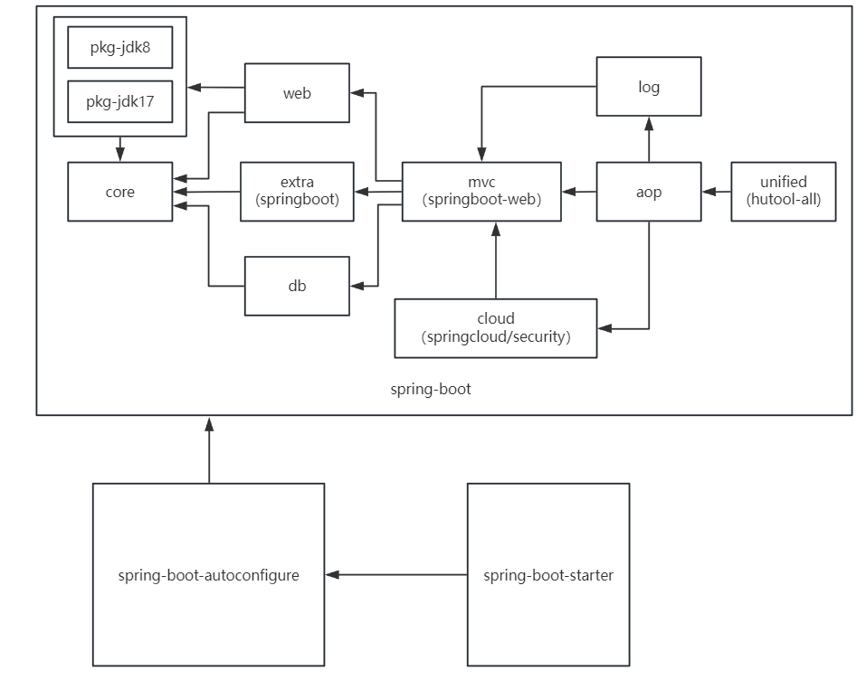

# xingtools 工具包

## :book:相关介绍
xingtools sdk 工具包，v1.1.2 正式版发布。( 依赖的版本不能低于 1.1.1 )
星天（xingtian）制作的 Java 工具包，是基于 Springboot 2.7.18 和 SpringBoot 3.0.5 制作的 ,  基于 Java 8 和 Java 17，它是一个整合各工具类的整合包。

### :scroll:简介

是一个功能丰富且易用的 **Java工具库**，通过诸多实用工具类的使用，旨在帮助开发者快速、便捷地完成各类开发任务。 这些封装的工具涵盖了hutool包（依赖[hutool包](https://gitee.com/dromara/hutool)）, 部分 ruoyi 工具类，包含了系列字符串、数字、集合、编码、日期、文件、IO、加密、数据库JDBC、JSON、HTTP客户端等一系列操作，还包含了 ACM算法，jdk版本兼容包，各种base接口，注解AOP装配，配置自动装配，可以满足各种不同的开发需求。

目前仍使用 xingtool 文档 v1.0.5 [使用文档](使用文档.md)，未来会更新。

###   :golf:本包说明

该依赖为 xingtools sdk 工具包 分组版本。 它是一个整合各工具类的整合starter。具体详情详见 [xingtool-spring-boot-starter](https://gitee.com/SangonomiyaKokomi/xingtool)  这个原sdk。 该分组工具包为升级版，将核心拆分应对不同使用情况，大大提高灵活性，未来原sdk可能会依赖该升级版的sdk。如果你是jdk任何版本（ jdk8, jdk17 ）都可以进行使用。唯一缺点就是可能会需要多个（两个及以上，因为需要导入pkg的jdk版本包）的依赖。

## :wrench:包含组件

| 模块                                | 介绍                                                         |
| ----------------------------------- | ------------------------------------------------------------ |
| xingtools-core                      | 核心，包括各种接口，实体类和工具类                           |
| xingtools-pkg-jdk8                  | 依赖core包，jdk 分类包，对不同的jdk版本提供兼容性            |
| xingtools-pkg-jdk17                 | 依赖core包，jdk 分类包，对不同的jdk版本提供兼容性            |
| xingtools-web                       | 依赖core和pkg包，提供一些 http 工具                          |
| xingtools-extra                     | 依赖core，附加，也就是基于 SpringBoot 的一些工具或实体类     |
| xingtools-db                        | 依赖core，数据库操作，包含mybatis-plus等操作                 |
| xingtools-mvc                       | 依赖web，extra，db三包，基于 SpringBoot-Web的一些集成工具或实体类 |
| xingtools-log                       | 依赖mvc，包含日志扩展操作的封装                              |
| xingtools-cloud                     | 依赖mvc，基于SpringCloud，包括各种 cloud，security，oauth 的工具 |
| xingtools-aop                       | 依赖mvc，log，cloud三包，提供前面依赖的aop注解和切面类       |
| xingtools-unified                   | 依赖aop，整合包，整合所有依赖并依赖 hutool-all               |
| xingtools-spring-boot               | 整合版本，排除pkg-jdk依赖，在这之后需要配合pkg-jdk依赖使用   |
| xingtools-spring-boot-autoconfigure | 整合版本的自动装配，含各种自动装配配置，开关，注解，类等     |
| xingtools-spring-boot-starter       | 最终依赖包                                                   |

当前版本组件之间的依赖关系如下：（v1.1.2 组件依赖更新）



​																**组件依赖关系图**

目前使 pkg包 仅依赖 core 包，可以按需导入从前面开始的依赖。

## :bookmark:依赖使用

### :inbox_tray:安装教程

> 使用 Maven 导入依赖

Maven 依赖（jdk8版本）

```xml
<dependency>
	<groupId>top.cutexingluo.tools</groupId>
	<artifactId>xingtools-spring-boot-starter</artifactId>
	<version>1.1.2</version>
</dependency>
<dependency>
	<groupId>top.cutexingluo.tools</groupId>
	<artifactId>xingtools-pkg-jdk8</artifactId>
	<version>1.1.2</version>
</dependency>
```

Maven 依赖（jdk17版本）

```xml
<dependency>
	<groupId>top.cutexingluo.tools</groupId>
	<artifactId>xingtools-spring-boot-starter</artifactId>
	<version>1.1.2</version>
</dependency>
<dependency>
	<groupId>top.cutexingluo.tools</groupId>
	<artifactId>xingtools-pkg-jdk17</artifactId>
	<version>1.1.2</version>
</dependency>
```

第二个包 （pkg包） 代表存在兼容 jdk 版本的工具，必须存在。

### :apple:使用方式

#### :lemon:使用讲解

1). 可以通过Util.静态类的方式调出静态方法，一般由XT开头的类，例如XTObjUtil等，以便直接调出类名、方法，根据类名意思了解该功能，好处是暂时不用查文档，并且和hutool互补，能够加快开发效率。
2). 可以通过new的方式获得非单例对象，也是常用的方式。
3). 在启动类上加上@EnableXingToolsServer，开启自动注入，比如默认开启的两个注解aop(例如@Printlog注解，以及其他现版本默认未开启的各种日志异常拦截aop等),其他的配置或者aop需要在配置文件中开启，以xingtools开头即可点出，例如

```properties
# 开启 redis
xingtools.enabled.redisconfig=true
# 开启 redis 的多个工具类，需 @Autowired 注入使用
xingtools.enabled.redisconfig-util=true
# 使用jackson2序列化(默认，可以不用配置)
xingtools.enabled.redisconfig-setting=jackson
# 默认全局异常拦截
xingtools.enabled.global-exception=true
# mybatis-plus 分页插件 这个还是推荐自己注册Bean
xingtools.enabled.mybatis-plus-config=true
```
> 注意这些只是进行了简单的配置，也就是大多数人的需求，也暂时不用每次自行创建配置类等。

> 所有aop和配置都可以通过配置类或者自行bean导入，导入启动后，会有日志说明配置启动成功，也可以用xingtools.enabled.log-info=false把自动导入的日志关闭。**由于减少侵入和大小占用，有些相应的配置解释会提供工件名，请自行配置相关依赖。**

- 4).也就是SpringSecurity,SpringCould的相关配置,可以通过配置@EnableXTCloudSecurity，@EnableXingToolsCloudServer，开启相关Security和Could的简化配置，精简你的项目。

综上不管是简单作为工具包，或者简化你的SpringBoot,SpringCloud等项目，该Starter放到你的依赖里也是一种不错的选择。

#### :pear:使用说明

1.  静态工具类，new对象
2.  @EnableXingToolsServer等注解启动装配，使用配置文件快捷开启对应配置


如有bug，欢迎反馈。


## :game_die:使用样例（xingtool v1.0.5 版本）

以下是最新版本的使用样例，可以加快你的开发

##### 1. 数据封装类，Controller 层

```java
@RestController
@RequestMapping("/admin")
public class AdminController {
    
    @RequestLimit // 限流注解
    @WebLog(match = "ip:uri:method+s+tab+ip", levelStr = "info", referer = "log1") // 打印日志注解
    @GetMapping("/user/getAll")
    public Result getAll() { // Result 对象 推荐使用
        //ResultUtil.selectResult 动态解析返回值 (false和null得到获取失败) 也可以直接使用 Result.success()
        return ResultUtil.selectResult(adminService.getAll(),"获取成功","获取失败"); 
    }
    
    // 这个注解是打印日志，其中一个策略是可以使用spEL表达式执行任意方法
    @WebLog(spEL = " @testService.hello ( #msgMap, #bundle ,'hello world') ") 
    @GetMapping("/user/getOne")
    public R<UserInfo> getOne() { // R对象 alias MSResult 支持泛型
        //ResultUtil.selectResult 动态解析返回值 (false和null得到获取失败) 也可以直接使用 Result.success()
        return ResultUtil.selectR(adminService.getOne(),"获取成功","获取失败"); 
    }
}
```

有人会说：我不想使用你的 Result 这个封装返回类，能不能自己定义。这是可以的，在1.0.3版本，统一了4个返回类，全部继承于CommonResult类，该类的基本属性如下：

```java
public class CommonResult<C, T> implements IResultSource<C, T> {
    protected C code;
    protected String msg;
    protected T data;
}
```

它实现 IResultSource 接口，而我们可以直接实现IResultSource或者再往上仅实现 IResult 接口就行了。基本上工具包的很多方法参数都是IResult 接口。我们可以直接实现该接口像这样：

```java
@Data
@NoArgsConstructor
@AllArgsConstructor
public class MyResult implements IResult<String,Object> {
    protected String retCode; // 不想使用 code，想使用 retCode
    protected String message; // 不想使用 msg，想使用 message
    protected Object data;
    
    @Override
    public Object getData() {
        return data;
    }
    @JsonIgnore
    @Override
    public String getCode() {
        return retCode;
    }
    @JsonIgnore
    @Override
    public String getMsg() {
        return message;
    }
}
```

对于不需要json转化的字段进行@JsonIgnore忽略掉就行。

同理如果不需要data字段，再往上实现 IResultData 接口(包含code和msg) 就可以，工具包里面的很多异常或者枚举都是实现了该接口。


##### 2.工具类使用，拦截器 以 OAuth2 为例（springboot2.x版本）

```java
@Component
public class MyTokenFilter extends OncePerRequestFilter {


    @Autowired
    private TokenStore tokenStore;

    // jwt解析类
    @Autowired
    private MyUserAuthenticationConverter myUserAuthenticationConverter;

    RYRedisCache redisCache;

    // 构造注入
    @Autowired
    public MyTokenFilter(RYRedisCache redisCache, ApplicationContext applicationContext) {
        this.redisCache = redisCache;
        AccessLimitUtil.setRedisCache(redisCache);
        AccessLimitUtil.setApplicationContext(applicationContext);
    }


    @Override
    protected void doFilterInternal(HttpServletRequest request, HttpServletResponse response, FilterChain filterChain) throws ServletException, IOException {

        try {
            // AccessLimitUtil 工具类 ， 可以利用 Redis 进行限流
            // limitFilter 解析方法上的注解
            boolean check1 = AccessLimitUtil.limitFilter(request, response, filterChain);
            if (!check1) return;
            // limitFilter IP 拦截
            boolean check2 = AccessLimitUtil.limitIP(request, response, 1, 20,
                    "访问过于频繁，请稍后访问");
            if (!check2) return;
        } catch (Exception e) {
            XTResponseUtil.forbidden(response, e.getMessage()); // 返回 403
            return;
        }

        Authentication authentication;
        try {
            // XTAuthenticationUtil 执行链操作，对token进行解析
            authentication = new XTAuthenticationUtil 
                    .AuthenticationBuilder(request, XTAuthenticationUtil.USE_HEADERS | XTAuthenticationUtil.USE_COOKIES) // headers 和 cookies 都要解析
                    .setTokenExtractor(tokenExtractor)
                    .setTokenStore(tokenStore)
                    .setAccessTokenConsumer(accessToken -> {
                        //XTAccessTokenUtil 对Oauth2 包的 AccessToken类进行解析
                        if (XTAccessTokenUtil.isExpired(accessToken)) { 
                            throw new AuthenticationServiceException("Token String 已经过期！");
                        }
}).setAccessTokenAdditionalConverter(myUserAuthenticationConverter::extractAuthentication)
                    .repairCreate("").build(); // 对 Authorization 头 进行解析
        } catch (AuthenticationServiceException e) {
            XTResponseUtil.unauthorized(response, e.getMessage());// 401 返回
            return;
        }
        if (authentication != null) { // 解析到token，设置上下文
            SecurityContext context = SecurityContextHolder.getContext();
            context.setAuthentication(authentication);
        }
        // 如果没有解析到，authentication会为空，然后交给资源服务判定

        filterChain.doFilter(request, response); 
    }
}

```


##### 3.系列注解使用，例如参数校验和异步线程

###### **参数校验** （必须导入 validation 包 并且参数添上@Valid或@Validated ）

```java
@Data
@AllArgsConstructor
@NoArgsConstructor
public class MyUserQuery {

    // 1.首先如果非空字符串和 null 均会进入下一步
    // 2.必须匹配下面指定字符串
    @StrStatus(anyStr = { // 必须匹配的字符串
            "1", "0"
    }, message = "类型格式错误",notBlankIfPresent = true) 
    private String type;

    @StrStatus(anyReg = { // 正则匹配
            RegexPool.MOBILE
    }, message = "手机格式错误") // 验证
    @StrJson(value = SensitiveSerializer.class, name = "PHONE") //脱敏
    private String phone;

    @NotBlank(message = "邮箱不能为空")
    @Email(message = "邮箱格式错误") //validation包的校验
    private String email;

    @StrJson(value = SensitiveSerializer.class, name = "") // 返回值脱敏
    private String password;
}

```

###### 异步线程 

1.可以使用**编程式**，例如 XTAsync, 或者你的类实现 ThreadHelper接口

2.使用**声明式**，但不一定会得到预期结果

TestThread 主线程类

```java
@Component
public class TestThread {
    @Autowired
    private ThreadResults threadResults; // 线程结果对象
    @Autowired
    private TestService testService;

    // value 建议和调用的子线程方法数量一致 , 默认策略 GetResultAfterLastSon 
    @MainThread(value = 2, startTime = ThreadTimePolicy.GetResultAfterLastSon)
    public void mainThread2() {
        testService.sonThread1(); // 子线程1 ,需要被代理，注解才能生效
        testService.sonThread2(); // 子线程2

        List<Object> results = threadResults.getResults();
        if (results != null) {// GetResultAfterLastSon 策略会阻塞等待 value数量的子线程执行完 , 所以该策略 results 始终会存在
            XTArrayUtil.printlnList(results); // 数组
        }

        List<Future<Object>> futures = threadResults.getFutures(); // GetFuture 策略会阻塞在当前主方法执行完，所以这时候results会为空，所以需要调用 future 的 get方法 阻塞 等待完成。如果没有调用，则会在当前方法结束时阻塞。
        XTArrayUtil.printlnList(futures);

        futures.forEach(future -> {
            try {
                System.out.println(future.get());
            } catch (InterruptedException | ExecutionException e) {
                e.printStackTrace();
            }
        });
    }
}
```

TestService 子线程类

```java
@Service
public class TestService {
    @SonThread(threadPoolName = "threadPoolExecutor") // 指定 Spring容器 里面线程池名称
    public String sonThread1() {
        System.out.println("进入sonThread1");
        XTTime.sleepBySecond(3); 
        System.out.println("sonThread1 已经睡了3秒");
        return "hello --> sonThread1";
    }
    @SonThread(threadPoolName = "threadPoolExecutor")
    public void sonThread2() { // 无返回值
        System.out.println("进入sonThread2");
        XTTime.sleepBySecond(1);
        System.out.println("sonThread2 已经睡了1秒");
    }

}
```


未完待续...

具体内容详见使用文档。

##  :memo:更新公告

**2024-8-8  v1.1.2**

```txt
bug 修复
1.由于未导入 spring-boot-starter-aop ，故启用 @EnableXingToolsServer 时使用 某个 aop 报错，目前将所有 aop 关闭；现在不使用 aop 不导入 aop 包，依旧能运行服务。
在v1.1.1版本需要配置  xingtools.ext-transaction-anno.enabled=false # v1.1.1 版本需要关闭。
2.修复 IntStatus 等参数校验注解未初始化的问题，以及数字匹配 matchNum 绝对匹配放行的问题。

更改部分
1.将 pkg-jdk8 和 pkg-jdk17 部分代码移除或移出到mvc包和cloud等其他包下，只做javax 和 jakarta 包的兼容，该包只依赖 core包。依赖关系更新。
2.cloud包将支持 cloud 和 security 两种模块，可以根据需要按需导入模块。

新增部分
1.cloud 包新增对 spring-security , spring-security-oauth2 和 spring-authorization-server 等不同依赖的支持。并提取两个依赖中的公共元素合并作为新的类集合。
例如：AuthToken, AuthAccessToken, AuthTokenExtractor, AuthTokenGenerator 等作为新的框架，和新的 XTAuthenticationBuilder 工具建造类对授权执行链的支持。
2.新增 HttpStatus 作为 Constants 的另一种实现形式。并对 Result 等一系列返回封装类添加对应方法。
3.新增系列集合类对 short 和 float 的支持，并新增 @ShortStatus 和 @FloatStatus 等参数校验注解。
```

**2024-7-17  v1.1.1**

```txt
中版本更新，为了保证灵活性。更改工具名 xingtool -> xingtools 。
更改部分
1.分离为多个包，例如分离core 包和 log 大包，保证 log 大包能够使用
2.部分强耦合方法被移除，例如移出 XTArrayUtil 的 logPrintln 等方法
3.更改大部分包名，例如 designtools.http 包名-> designtools.convert
4.部分类按包名合并，例如 designtools.distributed 合并到 utils.ee 里面
5.部分类消失简化操作等，例如Security Oauth的装配

移除部分
1.多个历史遗留类移除，例如移除类XTDataType
2.很多业务类和重复工具类移除，例如暂时移除 ruoyi 和 ican 的多个类，后续会合并到大工具类。如果已经使用了这些类的方法，请留级到 xingtool的 v1.0.5 版本
3.移除其他暂时不需要的类和冗余类，例如kotlin依赖等

支持 jdk8, jdk17 双版本
(为保证移植性，javax包减少使用，无法去掉则移植到 pkg-jdk8 包)
大包分为许多小包，可以按需依赖。
后续版本将 pkg 包降低其对 其他包依赖性，提高扩展性。
```

**2024-7-7  v1.0.5**

```txt
更改部分
1.允许 OptData 直接接受 null 值
2. RedisLockUtil 更改包名为 redis

新增部分
1.添加 Method Proxy 系列方法
2.新增 Serializer 序列化接口，及其子类 多种序列化类
3.新增 model 包，模型含有状态机等多种结构
4.扩展 OptBundle 系列方法

支持部分 SpringBoot3
新增使用文档
```

**2024-3-27  v1.0.4**

```
bug修复
1.紧急修复XTCallable 的 getSupplier 和 canRunTask 问题，并修复逻辑。
2.紧急修复 XTStrUtil findFirstOf错误调用自身的问题。 1.0.2-1.0.3 两个版本不要使用该方法。
3.修复单 pick 问题, 解决并发注解 @MainThread @SonThread 事务问题, 修复 TreeUtil 树转列表的问题
4.修复 ResultUtil 对 R类 的支持问题

更改部分
1.修改 @MainThread 默认时间策略为  GetResultAfterLastSon, 和原来没有什么差别。
2.修改了 XTMethodUtil 类方法名称 isAnnotationPresent => isHandlerMethodAnnotationPresent。
3.修改所有限流注解/工具的位置。
4.修改 XTLog 实现, 以及新增一系列 web 的 key 接口 和日志接口。
5.修改XTThreadPool、ThreadData默认核心线程，并修改ThreadHelper 命名防止冲突。

新增部分
1.新增 @StrJson 注解 返回数据时返回指定json字符串，并新增 StrJsonStrategy 接口的实现类 SensitiveSerializer 类用于敏感字符串脱敏，可自行实现StrJsonStrategy接口。
2.新增 SocketServer 和 SocketClient 等类 和 XTCollUtil 集合工具类。
3.新增 @RequestLimit 限流注解 和 RequestLimitHandler 工具类，可以取代 @Limit 和 @AccessLimit 注解,  提供了两个策略，可自定义策略，使用灵活。
4.新增 @WebLog注解 和 WebHandler 工具类，用于自定义策略日志打印，可以取代 @MethodLog 和 @XTSystemLog , 匹配, 模式串用法更灵活。
5.新增 OptBundle 类 用于执行链操作 , 和 OptionalResult 用于扩展 Optional 类。
6.新增 kotlin 依赖 临时支持 kotlin 。
```

**2023-12-25 v1.0.3**

```txt
bug修复
1. 修复了 AccessLimitUtil.limitIP 加载 Ipdb 错误 的bug

更改部分
1. 修改了XTCompletionService实现，以及ThreadLocalHelper文件位置
2. 所有web 拦截类 从 Result 改为返回 IResult 接口，并且添加 GlobalResultFactory 接口用于全局返回结果，使用时需要注册到容器。

新增部分
1. 新增top.cutexingluo.tools.utils.se.algo.cpp包，里面包含各种算法（有些未测试），例如数论，几何，数据结构，图论，字符串等
2. 新增 BoolUtil  用于使 java 适配 c++性质。
3. 新增XTArrayUtil一些方法，用于移动数组元素，新增 XTSetUtil 的 Set 工具类。
4. 新增ClassMaker类，用于转化和反射，可以配合XTObjUtil。
5. 增加了 CommonResult 类，用于返回通用结果, 四大返回类重新继承了该类。
6. 新增红黑树 RBTree，迭代器默认中序遍历，即默认升序排序。属性全为protected，方便子类继承。常规推荐使用 TreeMap
7. 新增各种迭代器用于适配多种情况。可自行继承使用。
8. 新增启用 server 的 banner 和 cloud server 的 banner
```

**2023-10-21 v1.0.2**

```txt
1. 添加了 Supplier 接口,。与之对应各种适配类的调整。
2. 添加多线程注解AOP @MainThread @SonThread
3. 调整 XTAsync 类 , 并且添加 ThreadHelper接口，更快速使用。
4. 添加 XTString 工具类，可以通过 C++ 方法名称的方式使用。
5. 重构代码（位置和代码）。以下为 v1.0.2 重构更新日志：

1.移除 XTExceptionAop 两个静态方法
2.添加 BaseAspectAroundHandler 接口默认方法
3.规范类的命名，例如ThreadLocal的工具类，规范了各工具类的用法注释
4.更改了 XTCallable 和 XTRunnable 的部分方法，添加 TryCatchHelper 等helper接口，方便直接使用工具类。例如 LockHelper, ThreadHelper 等
5.更改 XTProxy 的实现
6.更改了 XTResponseUtil 的参数, 使之更通用
7.新增 TreeUtil  树转列表
8.更改 LogInfo 类 转为 LogInfoDisable 类
9.为 RedisConfig , SpringSecurity Oauth2 添加用法注释
10.XTCallOtherUtil 更名为 XTCodeInteropUtil，关于生成其他语言代码的工具类
11.添加RabbitMQ系列初始工具类, 以及用法Test类, 可以不使用，没有太多优化的地方。
```
**2023-9-26 v1.0.1**
正式版发布，中央仓库 ,  依赖最低版本不能低于 v1.0.1

```txt
1. 含有基础日志、事务、线程、异常等AOP，需要通过配置文件开启。
2. 包含基础包 Callable , Runnable 等系列封装的函数式接口及其实现类，如 XTRunCallUtil 工具类。
3. 含有系列注解，如 StrStatus,  IntStatus 等注解，可以对类属性进行验证。
4. 含有MVC 封装返回值的封装接口及其四个实现类，可以应对任何 code , msg , data 三件套的情况。
5. 含有传统设计方法封装工具类，包含 XTBuilder, 反射, 多线程, 锁等工具类。
6. 含有拦截器封装的工具类，例如 Oauth2 Authentication 的过滤 ，IP 限流 等工具类。
7. 支持 SpringCloud Oauth2 的简化配置，例如 @EnableXTCloudSecurity 开启 JWT 自动导入Bean。
8. 含有各配置的开启，例如 MybatisPlus 分页插件和 Redis 的配置 及其 四个以上的Redis工具类和其他工具类。
9. 对RuoYi、ican工具类的大部分支持，对 hutool 工具包默认导入以及扩展。
10. 对一些其他语言的扩展工具类支持，例如 JS 系列的方法名称,, 以及其他语言的操作，生成。
11. 对加密解密的各种封装，以及对token解析的封装，但还是建议使用 hutool工具。
12. 对许多工具类的扩展，包含字符，文件，IO，map等，以及各种基本类的对应工具类。
```

在 properties/yml 配置文件输入 xingtools 即可查看相关自动配置。

在该版本中，使用 @EnableXingToolsServer 开启自动配置后，仅开启 配置开启日志和SpringUtils 注册，其他均默认关闭。
